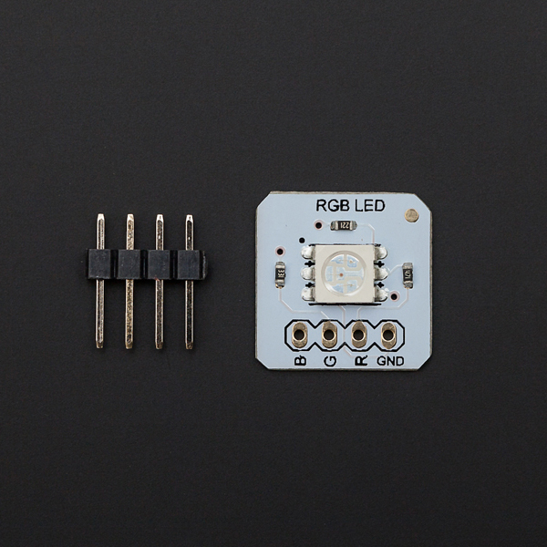

# DFRobot_RGBLED
- [中文版](./README_CN.md)

This small size breakout is programmable full-color RGB LED for hobbyists,<br>
industrial designers, prototypers, and experimenters. It is designed to <br>
allow the easy addition of dynamic indicators, displays, and lighting <br>
to existing or new projects. Controlled by PWM channels can be available <br>
in soft red, orange, yellow, green, blue and white...The high quality LED <br>
has wide viewing angle and optimized light coupling by inter reflector. <br>



## Product Link（https://www.dfrobot.com/product-900.html)    
    DFR0238：RGB LED Breakout (5050)
## Table of Contents

* [Summary](#summary)
* [Installation](#installation)
* [Methods](#methods)
* [Compatibility](#compatibility)
* [History](#history)
* [Credits](#credits)

## Summary
Provide an Arduino library to control the RGB lights
## Installation

To use this library, first download the library file, paste it into the \Arduino\libraries directory, then open the examples folder and run the demo in the folder.


## Methods
```C++

  /*!
   * @fn DFRobot_RGBLED
   * @brief Constructor 
   * @param redPin  the pin for controlling the red light of RGB channel
   * @param greenPin  the pin for controlling the green light of RGB channel
   * @param bluePin  the pin for controlling the blue light of RGB channel
   */
  DFRobot_RGBLED(uint8_t  redPin, uint8_t  greenPin, uint8_t  bluePin);

  /*!
   * @fn DFRobot_RGBLED
   * @brief Constructor 
   */
  DFRobot_RGBLED();

  /*!
   * @fn InitPins
   * @brief Initialize the pin, and set the brightness of the three lights of RGB channel to maximum 
   */
  void InitPins();
  
  /*!
   * @fn colorRGB
   * @brief Control the light color in RGB color format
   * @param red the brightness of the red light of RGB channel
   * @param green the brightness of the green light of RGB channel
   * @param blue the brightness of the blue light of RGB channel
   */
  void colorRGB(int red, int green, int blue);

  /*!
   * @fn colorHSV
   * @brief Control the light color in HSV color format
   * @param hue hue (H)
   * @param Value value (V)
   * @param Saturation saturation (S)
   */
  void colorHSV(int hue, int Value, int Saturation);
```

## Compatibility

MCU                | Work Well    | Work Wrong   | Untested    | Remarks
------------------ | :----------: | :----------: | :---------: | -----
Arduino Uno        |      √       |              |             | 
FireBeetle-ESP8266        |      √       |              |             | 
FireBeetle-ESP32        |      √       |              |             | 
Arduino MEGA2560        |      √       |              |             | 
Arduino Leonardo|      √       |              |             | 
Micro:bit        |      √       |              |             | 
FireBeetle-M0        |      √       |              |             | 
Raspberry Pi      |      √       |              |             | 


## History

- 2022/06/06 - Version 1.0.0 released.
## Credits

Written by fengli(li.feng@dfrobot.com), 2022.06.06 (Welcome to our [website](https://www.dfrobot.com/))
